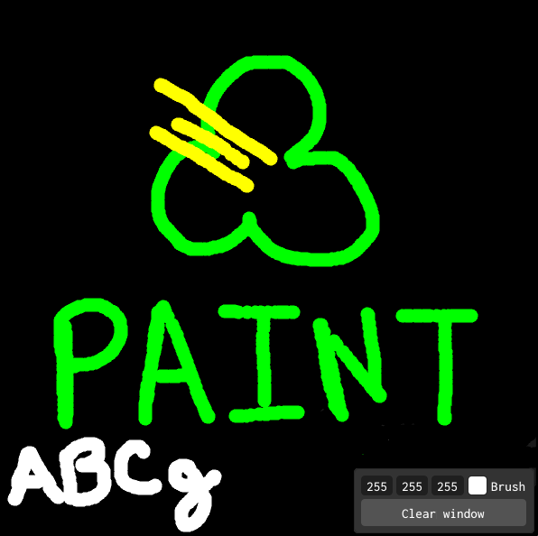

# Paint no ABCg

# Daniel Fusimoto Pires RA: 11201921874

## Descrição da aplicação

Essa aplicação simula uma tela de desenho simples, utilizando a implementação de OpenGL da biblioteca ABCg

## Implementação

A implementação da tela de pintura começa localizando onde o ponteiro do mouse está localizado, em seguida é feita uma transformação das coordenadas do ponteiro do mouse que está em pixels que variam de 0 até o tamanho da janela, para as coordenadas da janela dentro da aplicação que vão de -1 a 1.

Em seguida, caso o botão de pintura esteja pressionado, uma circunferência é desenhada com o centro sob o ponteiro do mouse. E como o buffer GL_COLOR_BUFFER_BIT, não é resetado a cada frame, aquela circunferência permanecerá na tela de pintura indefinidamente. Com isso, podemos simular um pincel utilizando o mouse.

Além disso, para o controle da cor do pincel, a aplicação escuta o conjunto de teclas {q, w, e, a, s, d}, permitindo aumentar ou diminuir os valores de RGB ao serem precionadas.

## Comdandos
- Mouse : posição do mouse determina onde está seu pincel na tela de pintura
- Botão esquedo do mouse : ativa o pincel para começar a desenhar
- Tecla "q" : aumenta o valor de R da panela RGB do pincel
- Tecla "a" : diminui o valor de R da panela RGB do pincel
- Tecla "w" : aumenta o valor de G da panela RGB do pincel
- Tecla "s" : diminui o valor de G da panela RGB do pincel
- Tecla "e" : aumenta o valor de B da panela RGB do pincel
- Tecla "d" : diminui o valor de B da panela RGB do pincel